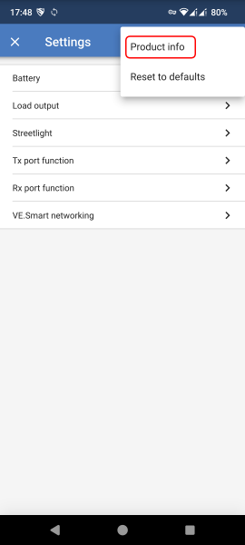
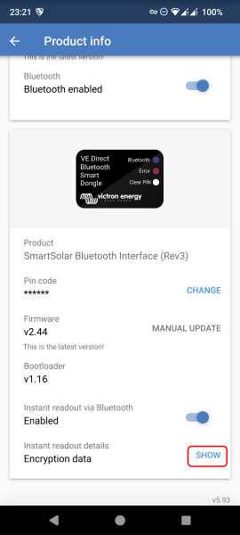
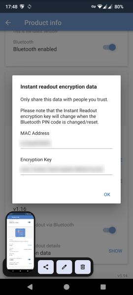

<div align="center">

# ESPHOME-VICTRON

[](https://github.com/havanti/esphome-victron) [](https://esphome.io) [](LICENSE)

[Devices](#supported-devices) • [Quick start](#quick-start) • [Bind keys](#reading-bind-keys) • [Example](#sample-configuration) • [FAQ](#faq)

[🇩🇪 Deutsch](README.md) | 🇬🇧 English

</div>

> **Note:** This repository is in no way affiliated with or endorsed by Victron Energy.
> Use at your own risk.

---

## Quick start

1. **Prepare an ESP32** — any BLE-capable board (e.g. [M5Stack Atom Lite](https://docs.m5stack.com/en/core/ATOM%20Lite)) within range of your Victron devices
2. **Read bind keys** — one per device via the VictronConnect app ([guide below](#reading-bind-keys))
3. **Build YAML** — see [sample configuration](#sample-configuration); pass MAC + bind key via `!secret`
4. **Flash** — `esphome run victron.yaml`

---

## Acknowledgements

Big thanks to **[Fabian Schmidt](https://github.com/Fabian-Schmidt)** for the original
[esphome-victron_ble](https://github.com/Fabian-Schmidt/esphome-victron_ble) repository.
This project is a fork of his work — the entire protocol implementation, decoding of
each device type and the detailed documentation come from him. Without his effort none
of this would exist.

Also thanks to Victron Energy for the [public documentation of the advertising protocol](https://community.victronenergy.com/questions/187303/victron-bluetooth-advertising-protocol.html).

---

## What this fork changes

The fork is intentionally minimally invasive and stays close to the upstream:

- **ESP-IDF only** — Arduino framework is rejected (maintainer rule)
- **C99 integer types** throughout (`uint8_t` instead of `u_int8_t`) — clean build under ESP-IDF 5.x
- **BinarySensor bugfix:** `publish_state("")` in default branches removed (incorrectly emitted `true`)
- **Bind keys = secrets:** `.git/info/exclude` protects local YAMLs containing keys from accidental commits

Functionally unchanged compared to upstream — all device types, sensors, triggers and
automation hooks from the original are preserved.

---

## Supported devices

| Family | Device types |
|---|---|
| **Battery Monitor** | SmartShunt, BMV-700/702/712, Smart Battery Sense |
| **Solar Charger** | BlueSolar / SmartSolar MPPT (all documented models) |
| **Inverter** | Phoenix Inverter, Inverter RS |
| **DC/DC** | Orion XS, DC/DC Converter |
| **Charger** | Blue Smart, AC Charger |
| **Lithium / BMS** | SmartLithium, Lynx Smart BMS |
| **Multi** | Multi RS |
| **Protection** | Smart Battery Protect |
| **Bus** | VE.Bus, DC Energy Meter |

> **Blue Smart Charger note:** firmware ≥ v3.61, VictronConnect ≥ v6.10beta14 required.
> Full model list: see [`components/victron_ble/victron_ble.h`](components/victron_ble/victron_ble.h)
> (enum `VICTRON_PRODUCT_ID`).

---

## Hardware

Plug & Play — no wiring. A BLE-capable ESP32 within range of your Victron devices is
enough. Recommended: **M5Stack Atom Lite** — compact, cheap, ESP-IDF-capable, and works
as an [ESPHome Bluetooth Proxy](https://esphome.io/components/bluetooth_proxy.html) for
other BLE devices at the same time.

---

## Reading bind keys

Two values are needed per Victron device:

- **MAC address** — Bluetooth address of the device
- **Bind key** — AES encryption key (32-character hex string)

In the [VictronConnect app](https://www.victronenergy.com/support-and-downloads/software) (≥ v5.93):

| Step | Screenshot |
|---|---|
| 1. Connect to device, open **Settings** |  |
| 2. Open **Product Info** |  |
| 3. Enable **Instant readout via Bluetooth**, press **SHOW** under *Encryption data* |  |

> **Important:** while the device is connected via VictronConnect, it does **not**
> emit advertisements. Close the app / disconnect after reading the data.

> **Bind key wrong?** On `victron_ble:XXX incorrect bindkey` check that exactly 32
> characters were copied — the app sometimes wraps the key onto an invisible second
> line. Use the clipboard button. If only 31 characters appear, reset the device's
> Bluetooth PIN.

---

## Sample configuration

Full example: [`victron_ble.yaml`](victron_ble.yaml). Minimal:

```yaml
external_components:
  - source:
      type: git
      url: https://github.com/havanti/esphome-victron
    refresh: always

esp32:
  board: m5stack-atom
  framework:
    type: esp-idf

esp32_ble_tracker:

victron_ble:
  - id: SmartShunt1
    mac_address: !secret victron_smartshunt_mac
    bindkey: !secret victron_smartshunt_bindkey

sensor:
  - platform: victron_ble
    victron_ble_id: SmartShunt1
    name: "SmartShunt Battery Voltage"
    type: BATTERY_VOLTAGE
  - platform: victron_ble
    victron_ble_id: SmartShunt1
    name: "SmartShunt Battery Current"
    type: BATTERY_CURRENT
```

`secrets.yaml`:

```yaml
victron_smartshunt_mac: "AA:BB:CC:DD:EE:FF"
victron_smartshunt_bindkey: "0123456789abcdef0123456789abcdef"
```

---

## Requirements

- **ESP32** (Classic, S3, C3 or C6 — anything with Bluetooth LE)
- **Framework:** ESP-IDF (Arduino is rejected)
- **ESPHome** ≥ 2026.4.3
- **VictronConnect app** ≥ 5.93 to read bind keys

---

## FAQ

### Which sensors are available for my device?

Each Victron device emits exactly one record type. The supported `type:` values per
record are defined in [`components/victron_ble/sensor/__init__.py`](components/victron_ble/sensor/__init__.py).
Rule of thumb: whatever the VictronConnect app shows on the overview page (before
connecting) also appears in the advertisement.

### How do I limit the update rate?

Standard ESPHome filters:

```yaml
- platform: victron_ble
  victron_ble_id: SmartShunt1
  name: "Battery Current"
  type: BATTERY_CURRENT
  filters:
    - throttle_average: 60s
    - timeout: 120s
```

See [ESPHome sensor filters](https://esphome.io/components/sensor/index.html#sensor-filters).

### Why am I not getting any data?

- VictronConnect app must be disconnected from the device (otherwise no advertisements)
- Bind key exactly 32 characters?
- ESP32 within range (check RSSI in logs, `logger: level: DEBUG`)
- `esp32_ble_tracker` enabled?

---

## License

GPL-3.0 — see [LICENSE](LICENSE). Original license carried over from Fabian Schmidt.
